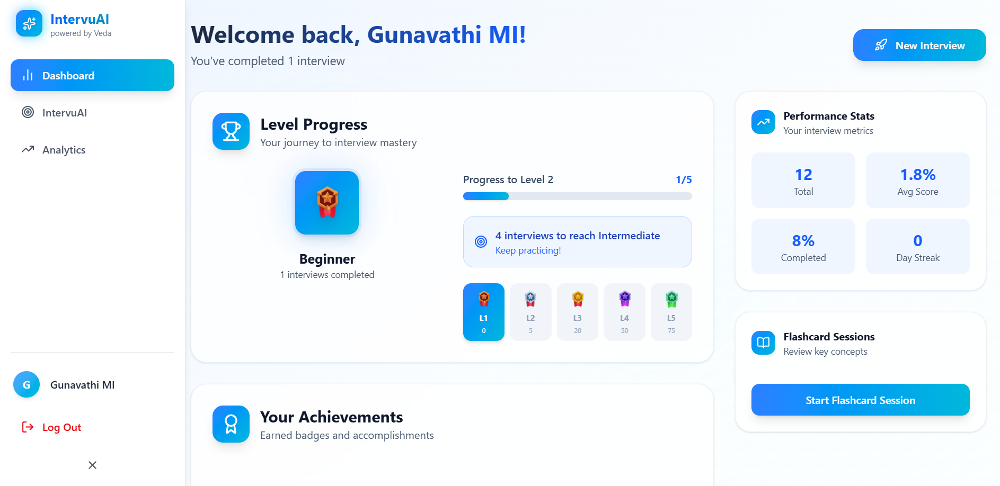
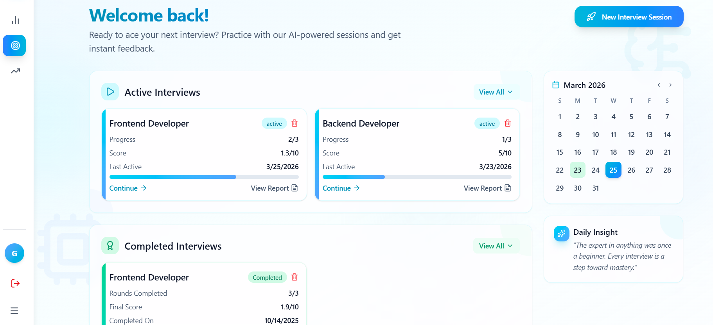
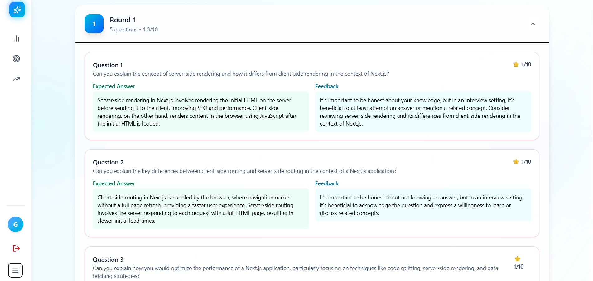
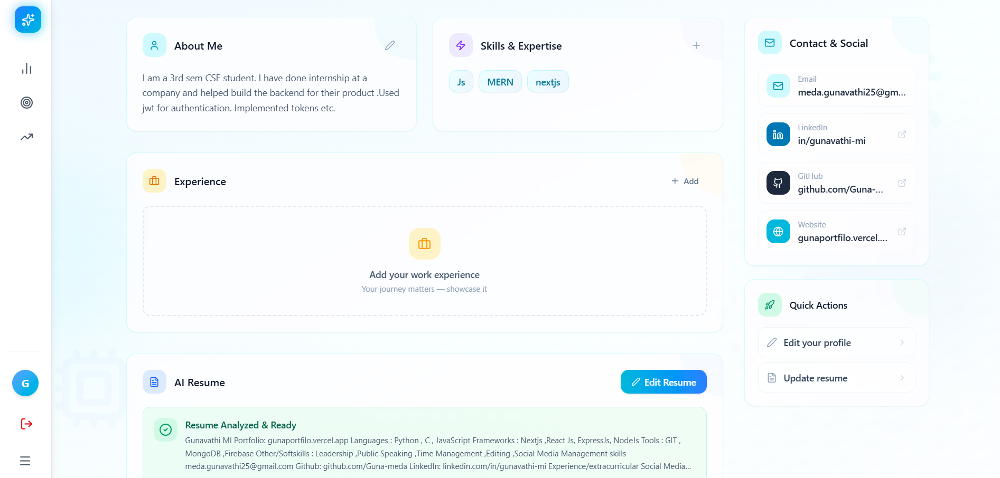

# Intervu AI

Try it out : https://intervu-ai-eta.vercel.app

A realistic AI interview simulator - built to feel like an actual product, not a demo.

You go through a proper interview flow: setup -> live interview -> feedback -> analytics.
The goal is simple: practice interviews in a way that actually helps you improve.

Wordering how the interview room looks? Try it out yourself!

## What You Can Do

- Set role + difficulty and start structured interview rounds
- Answer questions with live mic/camera
- Get AI-generated feedback instantly
- Track your performance across sessions
- View detailed analytics and reports
- Export reports to PDF if needed

## Core Features

### 1) Smart Interview Experience
- Multi-round interview sessions with configurable role and difficulty.
- AI-driven prepared questions and contextual follow-up flow.
- Real-time response capture and feedback loop per question.

### 2) Live Interview Room
- Browser media capture using WebRTC media APIs.
- Live speech recording/transcription service integration.

### 3) Advanced Analytics
- Performance dashboard with score trends and skill insights.
- Session statistics (history, completion, averages, consistency).
- Data visualizations via charts for easy interpretation.

### 4) Detailed Performance Reports
- Rich interview report view with round-level drill-down.
- Summary + analytics tabs for fast and deep analysis.

### 5) User Profile + Progression
- Persistent user session + app state using Zustand stores.
- Level/progression indicators based on interview activity.

### 6) Auth + Secure App Flow
- Firebase authentication integration.
- Protected app routes with authenticated navigation.
- Token-aware API communication to backend services.

## Tech Stack

- React + Vite
- Zustand (state management)
- Tailwind CSS
- Firebase Auth
- WebRTC (media handling)
- Recharts (analytics)
- Framer Motion (animations)
- Backend (Node.js/Express) + OpenAI API (not included in this repo)
- For transcription and audio processing, Google API is used.

## Note

This repo is the frontend part.
Backend + Firebase config is required for full functionality.

